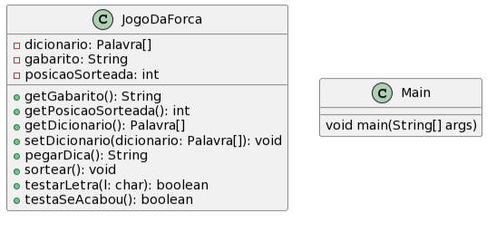
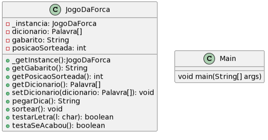
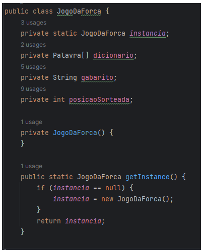

Link do repositório encontrado: https://github.com/ArthurPdaSilva/Jogo-da-forca/tree/main

## Exemplo código Original:
Ao ser criada uma instância da class JogoDaForca vai ser criado o jogo, necessitando que só haja uma instância dessa class, assim evitando ter mais mais de uma instancia rodando simultaneamente o tornando "mais leve".



```java
public class JogoDaForca {
    private Palavra[] dicionario;
    private String gabarito;
    private int posicaoSorteada;

    public String getGabarito() {
        return gabarito;
    }

    public int getPosicaoSorteada() {
        return posicaoSorteada;
    }

    public Palavra[] getDicionario() {
        return dicionario;
    }

    public void setDicionario(Palavra[] dicionario) {
        this.dicionario = dicionario;
    }

    public String pegarDica(){
        String pista;
        if(this.getPosicaoSorteada() < 5){
            pista = "Animal";
        }else if(this.getPosicaoSorteada() < 10){
            pista = "Fruta";
        }else if(this.getPosicaoSorteada() < 15){
            pista = "Veículo";
        }else{
            pista = "Roupa";
        }

        this.getDicionario()[this.getPosicaoSorteada()].setDica(pista);

        return this.getDicionario()[this.getPosicaoSorteada()].getDica();
    }

    public void sortear(){
        this.posicaoSorteada = (int)(Math.random() * this.getDicionario().length);
        this.gabarito = "";

        while(this.getDicionario()[posicaoSorteada] == null){
            this.posicaoSorteada = (int)(Math.random() * this.getDicionario().length);
        }

        for(int c = 0; c < this.getDicionario()[posicaoSorteada].getPalavra().length(); c++){
            this.gabarito += "?";
        }
    }

    public boolean testarLetra(char l){
        if(this.getDicionario()[posicaoSorteada].getPalavra().indexOf(l) != -1){
            char[] arrayR = this.getDicionario()[posicaoSorteada].getPalavra().toCharArray();
            char[] arrayG = this.gabarito.toCharArray();
            for(int c = 0; c < arrayR.length; c++){
                if(arrayR[c] == l){
                    arrayG[c] = l;
                }
            }
            this.gabarito = new String(arrayG);
            return true;
        }
        return false;
    }

    public boolean testaSeAcabou(){
        if(!this.getGabarito().contains("?")){
            this.getDicionario()[posicaoSorteada] = null;
            this.posicaoSorteada = -1;
            return true;
        }
        return false;
    }

}
```


## Padrão de Projeto Singleton
Ter certeza que a class JogoDaForca tenha apenas uma instância em todo o programa, e fornecer um ponto de acesso global para a mesma.

Para a aplicação do mesmo, adicionamos o atributo estático “instancia” para receber o objeto instanciado, o método construtor da classe JogoDaForca como privado para impedir a instância externa e um método getInstance para a instância da mesma, e caso já tenha sido instanciada antes, ele retorna a instância já existente. 





### JogoDaForca.java:

```java
public class JogoDaForca {
   private static JogoDaForca instancia;
   private Palavra[] dicionario;
   private String gabarito;
   private int posicaoSorteada;

   private JogoDaForca() {
   }

   public static JogoDaForca getInstance() {
       if (instancia == null) {
           instancia = new JogoDaForca();
       }
       return instancia;
   }
   public String getGabarito() {
       return gabarito;
   }

   public int getPosicaoSorteada() {
       return posicaoSorteada;
   }

   public Palavra[] getDicionario() {
       return dicionario;
   }

   public void setDicionario(Palavra[] dicionario) {
       this.dicionario = dicionario;
   }

   public String pegarDica() {
       String pista;
       if (this.getPosicaoSorteada() < 5) {
           pista = "Animal";
       } else if (this.getPosicaoSorteada() < 10) {
           pista = "Fruta";
       } else if (this.getPosicaoSorteada() < 15) {
           pista = "Veículo";
       } else {
           pista = "Roupa";
       }

       this.getDicionario()[this.getPosicaoSorteada()].setDica(pista);

       return this.getDicionario()[this.getPosicaoSorteada()].getDica();
   }

   public void sortear() {
       this.posicaoSorteada = (int) (Math.random() * this.getDicionario().length);
       this.gabarito = "";

       while (this.getDicionario()[posicaoSorteada] == null) {
           this.posicaoSorteada = (int) (Math.random() * this.getDicionario().length);
       }

       for (int c = 0; c < this.getDicionario()[posicaoSorteada].getPalavra().length(); c++) {
           this.gabarito += "?";
       }
   }

   public boolean testarLetra(char l) {
       if (this.getDicionario()[posicaoSorteada].getPalavra().indexOf(l) != -1) {
           char[] arrayR = this.getDicionario()[posicaoSorteada].getPalavra().toCharArray();
           char[] arrayG = this.gabarito.toCharArray();
           for (int c = 0; c < arrayR.length; c++) {
               if (arrayR[c] == l) {
                   arrayG[c] = l;
               }
           }
           this.gabarito = new String(arrayG);
           return true;
       }
       return false;
   }

   public boolean testaSeAcabou() {
       if (!this.getGabarito().contains("?")) {
           this.getDicionario()[posicaoSorteada] = null;
           this.posicaoSorteada = -1;
           return true;
       }
       return false;
   }

}
```

### Main.java:

```java
import java.io.BufferedReader;
import java.io.FileNotFoundException;
import java.io.FileReader;
import java.io.IOException;
import java.util.Scanner;
import java.util.logging.Level;
import java.util.logging.Logger;

public class Main {

   public static void main(String[] args) throws IOException {
       Scanner input = new Scanner(System.in);
       JogoDaForca jogo = JogoDaForca.getInstance();
       Palavra[] arrayValues = new Palavra[20];
       int pontos = 0, strike = 3;
       String linha;

       System.out.println("---J-O-G-O--D-A--F-O-R-C-A---");
       try {
           // Cria um objeto a partir do arquivo que eu quero que ele leia
           FileReader arq = new FileReader("palavras.txt");
           // Cria um fluxo de caractere com o arquivo ao invés de int
           BufferedReader lerArq = new BufferedReader(arq);

           // Preenchendo o array
           for (int c = 0; c < 19; c++) {
               linha = lerArq.readLine();
               arrayValues[c] = new Palavra();
               arrayValues[c].setPalavra(linha);
           }

           // Fechar o arquivo depois de lê
           arq.close();
       } catch (FileNotFoundException ex) {
           Logger.getLogger(Main.class.getName()).log(Level.SEVERE, null, ex);
       }

       jogo.setDicionario(arrayValues);

       // Sortear uma palavra:
       jogo.sortear();
       System.out.println("A dica é: " + jogo.pegarDica());

       // Enquanto ainda tiver palavra e o player só pode errar três vezes
       while (jogo.getDicionario()[jogo.getPosicaoSorteada()].getPalavra() != null && strike > 0) {
           if (jogo.testaSeAcabou()) {
               pontos++;
               System.out.println("A palavra era: " + jogo.getGabarito() + " e você tem " + pontos + " pontos");
               jogo.sortear();
               System.out.println("A dica é: " + jogo.pegarDica());
           } else {
               System.out.println("Que palavra é essa? " + jogo.getGabarito());
               System.out.println("Digite uma letra: ");
               String text = input.nextLine();

               // Testa a letra que o usuário escolher
               if (jogo.testarLetra(text.toCharArray()[0])) {
                   System.out.println("Acertou");
               } else {
                   strike--;
                   if (strike != 0) {
                       System.out.println("Errou, você só pode errar mais " + (strike) + " vezes");
                   }
               }
           }
       }

       System.out.println("A palavra era: " + jogo.getDicionario()[jogo.getPosicaoSorteada()].getPalavra());
       System.out.println("O jogo acabou, você adquiriu " + pontos + " pontos");
   }

}

```
